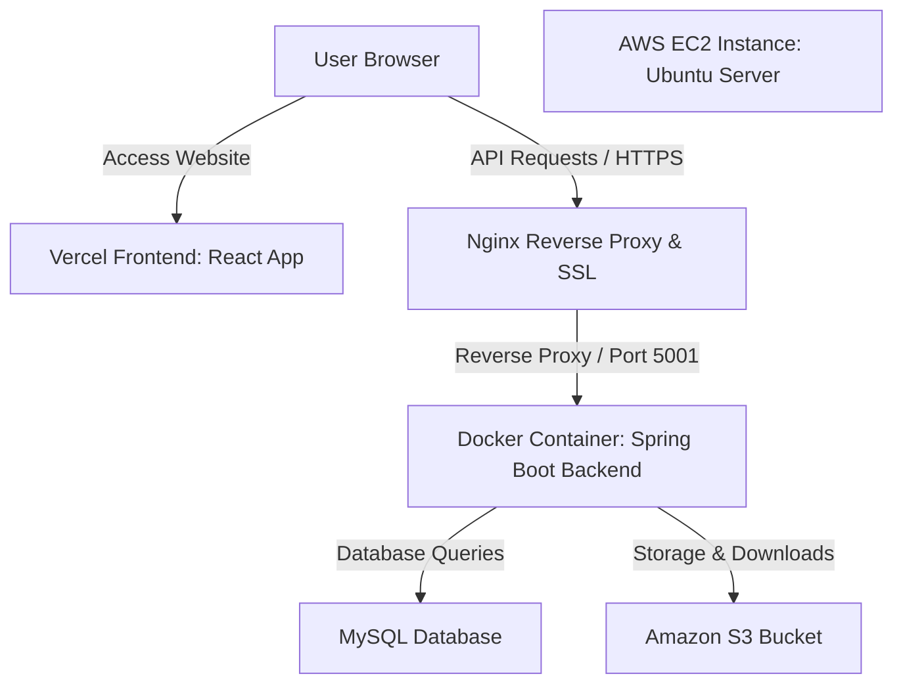

# Page Forge PDF Toolkit — Production Deployment Guide

This guide provides the complete step-by-step procedure to deploy the Page Forge PDF Toolkit in a production environment using **React (Vercel)**, **Spring Boot 3.3.0 (Docker inside AWS EC2)**, **MySQL Database**, **AWS S3 (Cloud Storage)**, **Nginx (Reverse Proxy with SSL on port 5001)**, and **GitHub Actions (CI/CD)**.

---

## 1. Cloud Architecture



---

## 2. Step-by-Step Deployment Guide

### Phase 1: Amazon S3 & IAM Configuration
To store uploads and processed files securely:

1. **Create an S3 Bucket**:
   * Open the **AWS Console** and go to **S3** → **Create Bucket**.
   * Enter a unique bucket name (e.g., `page-forge-toolkit-storage`).
   * Select your preferred AWS Region (e.g., `us-east-1`).
   * Keep **"Block all public access"** checked (highly secure; our app communicates using pre-signed URLs).
   * Click **Create Bucket**.

2. **Configure IAM Policy & Credentials**:
   * Navigate to **IAM** → **Policies** → **Create Policy**.
   * Switch to the **JSON** tab and paste the following policy:
     ```json
     {
         "Version": "2012-10-17",
         "Statement": [
             {
                 "Effect": "Allow",
                 "Action": [
                     "s3:PutObject",
                     "s3:GetObject"
                 ],
                 "Resource": "arn:aws:s3:::page-forge-toolkit-storage/*"
             }
         ]
     }
     ```
   * Name the policy (e.g., `PageForgeS3Policy`) and click **Create**.
   * Go to **Users** → **Create User**. Name it `page-forge-app-user`.
   * Under **Permissions**, select **"Attach policies directly"** and search for `PageForgeS3Policy`.
   * Create an Access Key (`Access Key ID` and `Secret Access Key`) and save it securely.

---

### Phase 2: Launch and Configure AWS EC2 & MySQL

1. **Provision EC2 Instance**:
   * Go to **EC2 Console** → **Instances** → **Launch Instance**.
   * **OS**: Select **Ubuntu Server 22.04 LTS**.
   * **Instance Type**: Select `t3.small` or `t3.medium` (Java 21 / Spring Boot requires at least 2GB RAM).
   * **Security Group**: Allow inbound SSH (22), HTTP (80), and HTTPS (443).

2. **Install Docker, Java 21, and Nginx on EC2**:
   ```bash
   ssh -i "your-key.pem" ubuntu@<ec2-ip>

   # Update packages
   sudo apt update && sudo apt upgrade -y

   # Install Docker
   sudo apt install docker.io -y
   sudo systemctl enable --now docker
   sudo usermod -aG docker ubuntu

   # Install Nginx
   sudo apt install nginx -y
   sudo systemctl enable --now nginx
   ```

---

### Phase 3: Environment Variables & Nginx Setup

1. **Configure Environment Variables**:
   Create `/home/ubuntu/.env` on EC2:
   ```env
   PORT=5001
   SPRING_DATASOURCE_URL=jdbc:mysql://localhost:3306/page_forge?createDatabaseIfNotExist=true&useSSL=false
   SPRING_DATASOURCE_USERNAME=root
   SPRING_DATASOURCE_PASSWORD=your_db_password
   JWT_SECRET=pageforge_jwt_secret_dev_key_must_be_at_least_32_bytes_long_for_hs256_security
   JWT_REFRESH_SECRET=pageforge_refresh_secret_dev_key_must_be_at_least_32_bytes_long_for_hs256_security
   GEMINI_API_KEY=your_gemini_api_key
   AWS_ACCESS_KEY_ID=your_iam_access_key_id
   AWS_SECRET_ACCESS_KEY=your_iam_secret_access_key
   AWS_REGION=us-east-1
   S3_BUCKET_NAME=page-forge-toolkit-storage
   ```

2. **Setup Nginx Reverse Proxy**:
   Configure `/etc/nginx/sites-available/pageforge`:
   ```nginx
   server {
       listen 80;
       server_name api.yourdomain.com;

       client_max_body_size 100M; # Permits large PDF uploads

       location / {
           proxy_pass http://127.0.0.1:5001;
           proxy_http_version 1.1;
           proxy_set_header Upgrade $http_upgrade;
           proxy_set_header Connection 'upgrade';
           proxy_set_header Host $host;
           proxy_cache_bypass $http_upgrade;
           proxy_set_header X-Real-IP $remote_addr;
           proxy_set_header X-Forwarded-For $proxy_add_x_forwarded_for;
           proxy_set_header X-Forwarded-Proto $scheme;
       }
   }
   ```
   Activate and test:
   ```bash
   sudo ln -s /etc/nginx/sites-available/pageforge /etc/nginx/sites-enabled/
   sudo rm /etc/nginx/sites-enabled/default
   sudo nginx -t
   sudo systemctl restart nginx
   ```

3. **Install Let's Encrypt SSL**:
   ```bash
   sudo apt install certbot python3-certbot-nginx -y
   sudo certbot --nginx -d api.yourdomain.com
   ```

---

### Phase 4: Configure GitHub Actions CI/CD Pipeline

Add GitHub Secrets under **Settings** → **Secrets and variables** → **Actions**:

| Secret Name | Value |
| :--- | :--- |
| `DOCKER_USERNAME` | Your Docker Hub account username |
| `DOCKER_PASSWORD` | Your Docker Hub account password or Access Token |
| `EC2_HOST` | Your EC2 Domain or public IP |
| `EC2_USERNAME` | `ubuntu` |
| `EC2_SSH_KEY` | Paste your complete `.pem` private key content |

When code is pushed to `main`, the CI/CD pipeline compiles `SpringBoot-BackEnd`, pushes the Docker image to Docker Hub, and restarts the backend container on EC2 on port `5001`.

---

### Phase 5: Deploy Frontend to Vercel

1. Import the GitHub repo into Vercel.
2. Select **Framework Preset**: Vite, **Root Directory**: `frontend`.
3. Set **Environment Variable**: `VITE_API_URL=https://api.yourdomain.com`.
4. Click **Deploy**.

---

## 3. Maintenance Commands

* **Check running container**:
  ```bash
  docker ps
  ```
* **View real-time application logs**:
  ```bash
  docker logs -f page-forge-backend
  ```
* **Restart the backend manually**:
  ```bash
  docker restart page-forge-backend
  ```
